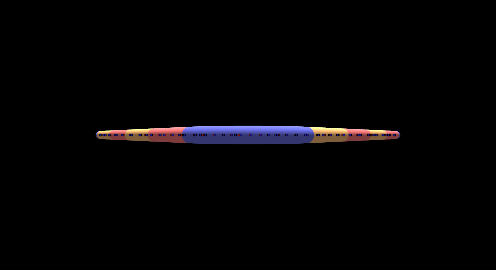
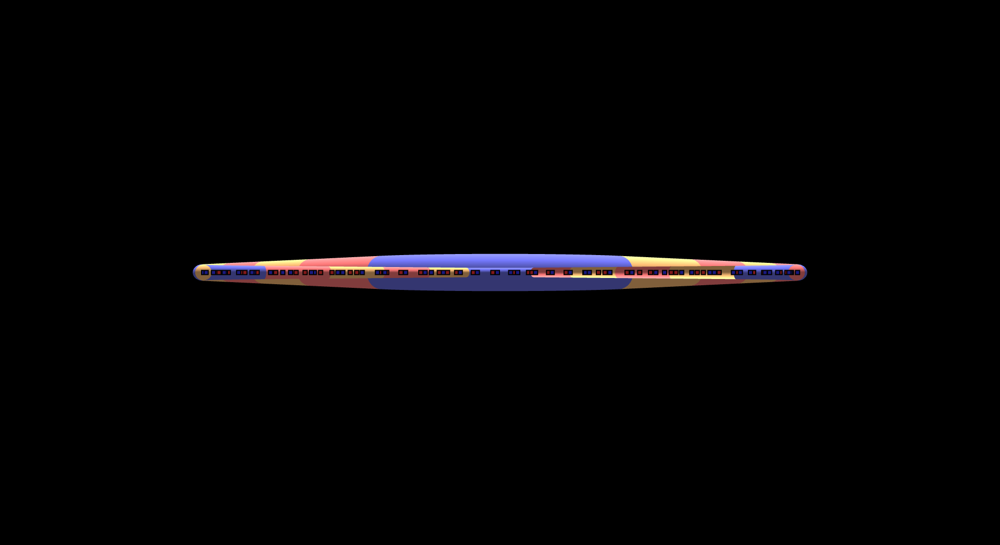
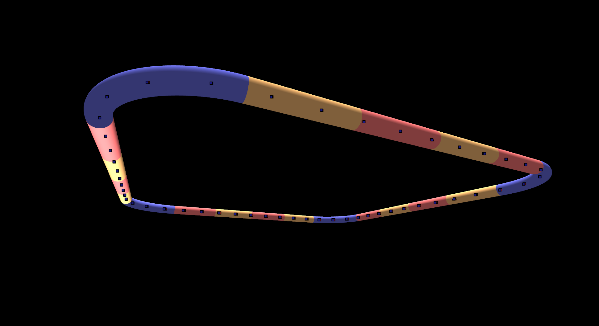

# Particle Accelerator

## OwO what's this ?

This project simulates the behavior of a very simplified particle accelerator.\
In the current configuration, it is a simple circular accelerator composed of straight elements, focalizer elements, and dipoles.\
It is planned to add a way to edit the accelerator, but you can of course simply add it manually by modifying the code and recompiling.

## Features

- Physics
	- Bi-directional accelerator for pawsitively and negatively charged particles
	- Inter-particle interactions
	- Käse (partition the accelerator in pizza slices to optimize inter-particle interactions)
	- Approximate and exact collision detection controlled by `bool methodChapi` (we however only use the approximate one here because we would have to recallibrate the accelerator's magnetic fields if we were to use the exact one)
	- Beam construction controlled by `bool beamFromParticle`
		- Using a physical source of Particle from the default Particle position by evolving a Particle a given number of times
		- Or by spreading out a given number of Particles along the ideal trajectory
	- FODO (`Frodo`) elements
	- `Proton`, `Antiproton`, `Electron` classes
- Graphics (Qt used as an openGL wrapper)
	- VBO-optimized rendering
	- Lighting (kinda)
	- Antialising
	- Framerate-independant movement
	- VSync
- Application
	- Fluid mouse and keyboard controls
	- Framerate indicator
	- Pause and speed control
- Development
	- `TextRenderer`: log to file or to stream
	- Custom error management (`exceptions.h`)
	- Centralized controls in `common/globals.h`
	- Centralized qmake to generate all executables

## Time management

About 6-8 hours per week per person

## History

All the very serious, clear and professional 300+ commit messages can be found through `git`

## Controls

| Key | Description |
| --- | --- |
| W | Camera forward |
| S | Camera backward |
| A | Camera left |
| D | Camera right |
| Q | Camera down |
| E | Camera up |
| Space | Pause physical simulation |
| Up | Increase simulation speed |
| Down | Decrease simulation speed |

## Compilation

Requirements: `qt5-default`
Optional: `doxygen` (documentation)

```sh
qmake && make && bin/app.bin
```

This does NOT compile on the computers in CO (too old versions for `g++` and `qmake`) !!

| Software | Version in CO | Version on our computers |
| --- | --- | --- |
| Qt | 5.5.1 | 5.9.5 |
| qmake | 3.0 | 3.1 |
| g++ | 5.5.0 | 7.4.0 (c++1z) |
| doxygen | 1.8.11 | 1.8.13 |

The problem is we use `inline` variables, new since c++17

See `docs/Conception.md` for more information.

## Documentation

```sh
rm doxydocs/* -r && doxygen Doxyfile
# Optional to run from command line
xdg-open doxydocs/html/index.html
```

See `docs/` for more information

## Further development

- Integrate our project with Qt completely
- Fix lighting issues
- Rewrite a few classes for neater code
- Add a good accelerator editor
- Calibrate accelerator to our settings
- Add auto calibrator (adjust magnetic fields and speeds)
- Add floor/sky box
- Add emittance graph
- Add pasta texture on elements (penne + macaroni)
- Add Sextupole
- Add realistic `Beam`
- Research move semantics for better physics engine
- Research graphics optimizations using index buffer

## Known ~~bugs~~ features

- Lighting comes from below in a part of the accelerator, for some reason
- On some graphics cards (e.g. integrated intel cards), the depth buffer for the drawing calls is bugged and you can see through some elements. This does _not_ happen on nvidia cards.



_Dedicated graphics card_



_Integrated graphics card_



_Lighting bug for whatever reason_
